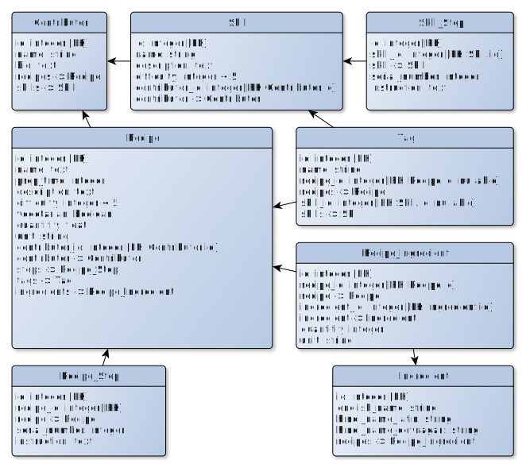

# Samys-Cookbook

Making a simple app using React and Flask.

# TODO

## Backend

-   [x] `/api/recipe/meta` or something to get meta-info about recipes and
        skills
-   [ ] the backend only handles recipes now, we need the same for skills

## Frontend

-   [x] delete the frontend and start from scratch (non-functional react components 🤮)
-   [x] basic react router homepage and recipe list setup

## Other

-   [ ] Make proper readme page (highlight the stuff used, what it does, etc)
-   [ ] maybe make another backend using mongodb or something (document based databases might work well for this)

# credits

-   authorization added by following [this](https://dev.to/nagatodev/how-to-add-login-authentication-to-a-flask-and-react-application-23i7) page

# How to run

-   Run the command `npm run cookbook`

# Database

# Notes

-   Initially, this project will have a plain html front-end (using
    render_template in flask).
-   I will make a react JS front-end after I actually learn React.

# What

-   This will be a simple site to host my recipes.
-   It will have a react front-end, a flask back-end with a Sqlite(for now
    atleast) db.
-   I will have to learn both react (from scratch) and flask (of which I do have
    a basic knowledge).\

# My Plans

## Front-End (made on 20211105 00:15:45, I don't know what will actually happen)

### Nav bar

-   Home
-   Recipes
-   Skills
-   What can I make page
-   About

### Home Page

-   A nice header image.
-   Display 5 (randomly) of each type of cards:
    -   skills (how to do stuff like dice onions, boil your pasta, etc.)
    -   recipes (actually making the stuff needed)
-   Recipe cards:
    -   An image
    -   The name of the dish.
    -   The preparation time.
    -   A short description.
    -   The Difficulty level.
    -   Veg or non-veg badge at the top.
-   Skills cards:
    -   An image
    -   The name of the dish.
    -   The preparation time.
    -   A short description.
    -   The Difficulty level.
    -   Veg or non-veg badge at the top.
    -   How important the skill is

### Recipes/skills Page

> NOTE: These will be two separate pages

-   A list (maybe just a grid of cards) of all the recipes/skills (which can be
    filtered).
-   Clicking on which will open the page of the specific recipe/skill

### Individual Recipe/skill pages

> Separate pages for each (using templates i guess)

-   A header image
-   All the info on the card
-   Ingredients
-   Steps (clicking on a sentence which is a skill should include a link to that
    skill, for example: the line is 'boil your pasta until al dente', then it
    should be a link to the skill page of 'boiling pasta')
-   How to prepare or whatever else i will need

### About Page

-   A link to my github, and socials(lol!).
-   And a short bio or such

### What can I make page

-   The user should be able to select a number of ingredients. (and what to
    search: recipes or skills)
-   The site must then give back the possible recipes/skills which are possible
    with the given ingredients

## Back-End

-   I need a rest api using flask
-   This is the first thing i will do

### Routes:

-   **/**: the home page
-   **/Recipes**: the recipes page
-   **/Skills**
-   **/Recipe/name**: the page for an individual recipe
-   **/Skill/name**: the page for an individual skill
-   **/get-recipes**(workshop the name for this one): the page for the 'what can
    i make page', it will send a get/post (i don't know which) request which
    will return the
-   **/about**
-   There will be an easter egg, find it if you can ;)

## DB

-   Look at the database_design.graphml (or .jpg) file.
-   I don't know how a db this complex will be stored, i might have to use plain
    sql cause i don't know how the flask sqlalchemy stuff works.
-   this is going to be tricky

# environment variables required

| variable name  | prod or dev | required value |
| :------------: | :---------: | :------------: |
|   FLASK_ENV    |     dev     |  development   |
| JWT_SECRET_KEY |    both     |       -        |
| MYSQL_PASSWORD |    both     |       -        |
| MYSQL_USERNAME |    both     |       -        |
|  MYSQL_SERVER  |    both     |       -        |
|    MYSQL_DB    |    both     |       -        |

